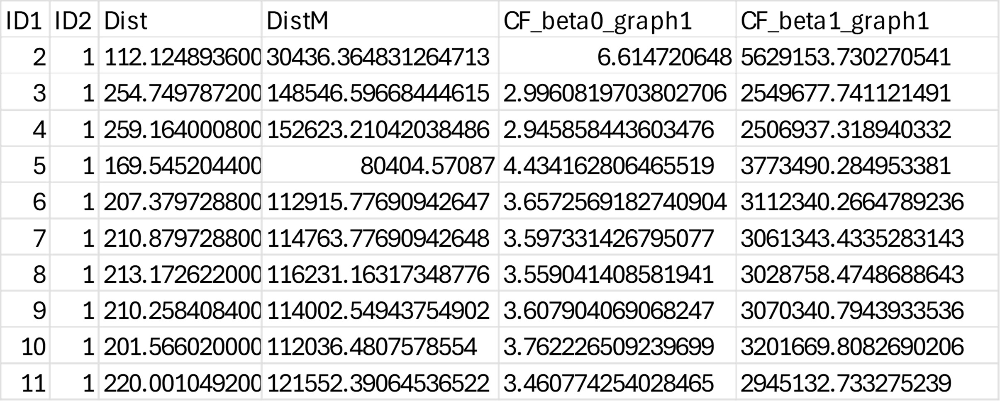

---
title: "Assignment of Unique Identifiers to Patches in Connectivity Modeling Using Graphab"
author: "Sebastián Sánchez Cuartas"
date: "`r format(Sys.Date(), '%B %d, %Y')`"
output: 
  html_document:
    toc: true
    toc_depth: 2
    theme: united
    highlight: tango
    css: styles.css
---

The following code serves a specific purpose in connectivity modeling using Graphab. When Graphab loads a raster containing patches, it automatically enumerates these patches from 1 to the total number of patches, following a west-to-east and north-to-south pattern. This enumeration determines the identity of the indices between patches, known as Site ID. In this case, the Site ID corresponds to a particular species (see Figure 1).

The script provides a solution to maintain the traceability of patches since Graphab loses the original species identity during enumeration. By assigning a unique numerical identifier to each patch, the script facilitates the retrieval of the original species identity in the final connectivity report (Figure 2). This is particularly useful when there are numerous patches each containing only one individual.

The code uses a CSV file as input, which should include the species names in the first column, and the longitude and latitude coordinates in the subsequent columns.


```{r eval=FALSE, include=TRUE}
# Load necessary libraries
library(sf)
library(dbplyr)

# Define the path to the CSV file with the points
points_file <- "path/to/your/Clados_Combinados.csv"

# Load the points from the CSV file
points <- read.csv(points_file, header = TRUE)

# Convert the dataframe to an sf object
points_sf <- st_as_sf(x = points, 
                      coords = c("Longitude", "Latitude"), 
                      crs = 4326)

# Sort the points by geographic position in descending order
points_sf <- points_sf[order(-st_coordinates(points_sf)[, "Y"], -st_coordinates(points_sf)[, "X"]), ]

# Assign sequential values to the points
points_sf$enumeration_value <- seq_len(nrow(points_sf))

# Save the CSV file with the sorted and enumerated points
write.csv(points_sf, file = points_file, row.names = FALSE)

# Define the path to the CSV file
points_file2 <- "path/to/your/Clados_Combinados.csv"

# Load the points from the CSV file without headers
points2 <- read.csv(points_file2, header = FALSE)

# Rename columns
colnames(points2) <- c("Site.ID", "Longitude", "Latitude", "ID")

# Remove the first row containing incorrect headers
points2 <- points2[-1, ]

# Remove "c(" from the Longitude column
points2$Longitude <- gsub("c\\(", "", points2$Longitude)

# Remove ")" from the Latitude column
points2$Latitude <- gsub("\\)", "", points2$Latitude)

# Swap Latitude and Longitude columns
points2 <- points2[, c("Site.ID", "Latitude", "Longitude", "ID")]

# Save the CSV file with the changes made
write.csv(points2, file = points_file2, row.names = FALSE)

```

...

```{r echo=FALSE, fig.align='center', fig.cap="**Figure 1.** *Shows the numbers assigned to the patches and how Graphab enumerates them sequentially from west to east and from north to south. This enumeration pattern is used by the script to reassign the original identities to the IDs in the final output.*", out.width='65%'}
knitr::include_graphics("enumeracion_graphab.jpg")
```

...

```{r echo=FALSE, fig.align='center', fig.cap="**Figure 2.** Illustrates the final report generated by Graphab, which displays the patches (IDs) along with the specific indices calculated. These IDs are used to restore the original species identities.*", out.width='65%'}

```